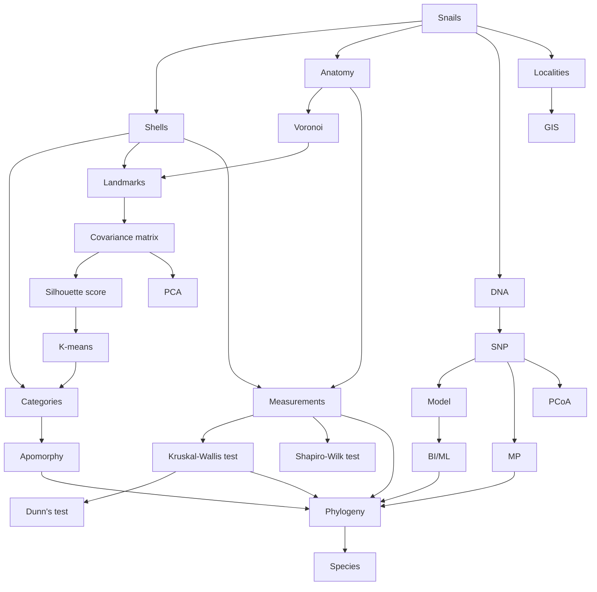

# When discrete characters are wanting

Continuous character integration under the phylospecies concept informs the revision of the Australian land snail *Thersites* (Eupulmonata, Camaenidae) 

## Description

Folder structure of the *Thersites* project.

This project provides an organized folder structure for the Thersites project, which is divided into four main modules: morphology, molecular, character, and GIS.

The **morphology** module contains data related to the shapes and structures of snail shells and genitalia. Within this module, the `shell` folder holds data on shell morphology, while the `genital` folder is dedicated to genital morphology and is further subdivided into two folders: `flagellum`, which contains data on the flagellum, and `measurement`, which stores measurement data.

The **molecular** module focuses on molecular data optimization and phylogenetic analyses. The `dartR` folder holds SNP call data generated using dartR. The `model` folder contains model selection files. It includes several subfolders that organize different analytical methods: the `BI` folder contains data from Bayesian Inference phylogenetics; the `ML` folder contains Maximum Likelihood phylogenetics data; and the `MP` folder contains Maximum Parsimony phylogenetics data. The `MP` folder is further divided into three subdirectories, `EIW` (Extended Implied Weighting), `EW` (Equal Weighting), and `IW` (Implied Weighting), each corresponding to a different weighting strategy. 

The **character** module includes files related to character optimization projects. This module is subdivided into four folders, each serving a specific analytical purpose: the `contmap` folder contains files for continuous character mapping; the `kmeans` folder holds data for k-means clustering analysis; the `apomorphy` folder stores apomorphy analysis results generated by TNT and WinClada; and the `kruskal` folder includes results from the Kruskal-Wallis test based on phylogenetic lineages.

Lastly, the **GIS** module is dedicated to geographic information system (GIS) data, which records species occurrences and distribution information. 

```
.
├── character
│   ├── apomorphy
│   ├── contmap
│   ├── kmeans
│   └── kruskal
├── GIS
├── molecular
│   ├── BI
│   ├── dartR
│   ├── ML
│   ├── model
│   └── MP
│       ├── EIW
│       ├── EW
│       └── IW
└── morphology
    ├── genital
    │   ├── flagellum
    │   └── measurement
    └── shell
```

## Technology roadmap


