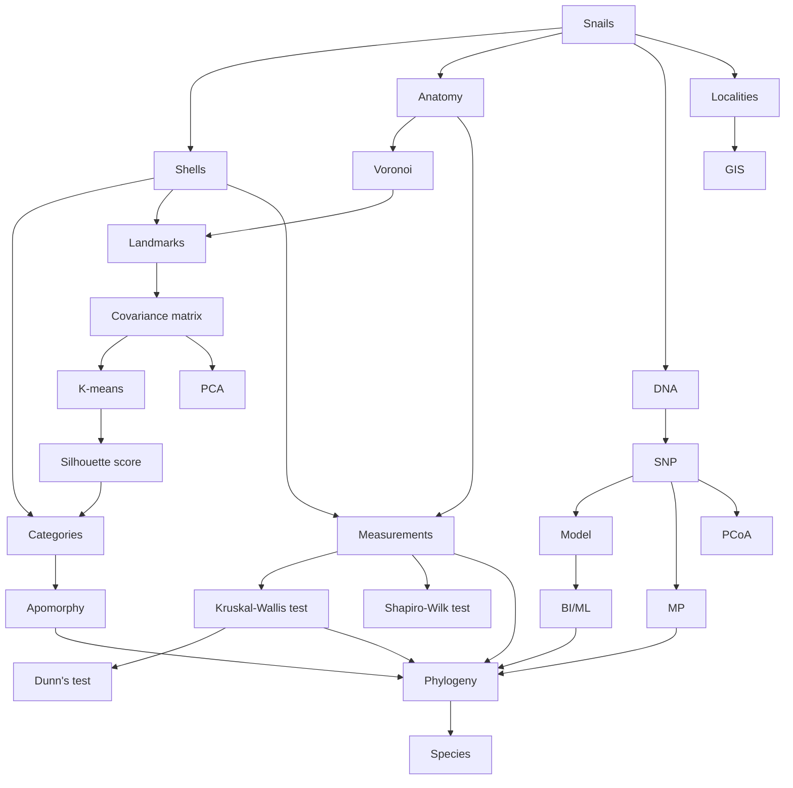

# Thersites

```mermaid
graph TD
    A[Snails] --> B[Shells]
    A --> C[Anatomy]
    A --> D[DNA]
    A --> E[Localities]

    B --> B1[Categories]
    B --> B2[Landmarks]
    B --> B4[Measurements]

    B2 --> B3[Covariance matrix]
    B3 --> B7[K-means]
    B7 --> B8[Silhouette score]
    B8 --> B1
    B3 --> B5[PCA]
  
    C --> C1[Voronoi]
    C --> B4
    C1 --> B2

    B4 --> C2[Kruskal-Wallis test]
    B4 --> B6[Shapiro-Wilk test]
    B1 --> C3[Apomorphy]
    C2 --> C4[Dunn's test]

    C3 --> F1[Phylogeny]
    B4 --> F1
    C2 --> F1

    D --> D1[SNP]
    D1 --> D2[Model]
    D1 --> D3[MP]
    D2 --> D4[BI/ML]
    D4 --> F1
    D3 --> F1
    D1 --> D5[PCoA]

    E --> E1[GIS]
    F1 --> G[Species]
```
